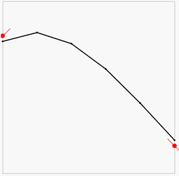
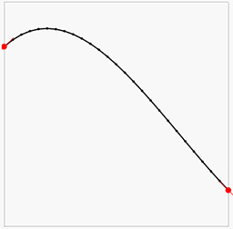
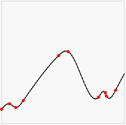
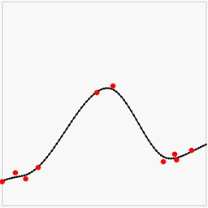
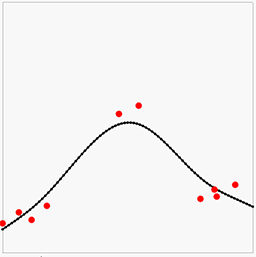

# Field interpolation using the finite difference method
A method for interpolating sparse and/or noisy data in one or several dimensions. Can be used to generate a signed distance field from a point cloud.

# Code structure
The library is in `field_interpolation/`. `src/` contains an example app.

# Description
## Introduction
Say we want to approximate some function `f(x) = y`. We have some *data* about the function. Value data (e.g. `f(0) = 4` and `f(5) = 2`) and (optionally) gradient data (e.g. `f′(0) = 1` and `f′(5) = -1)`. We can also make assumptions about the *model* (how the function behaves). We can, for instance, assume that the function is smooth: `f″(x) = 0`. Let us now approximate the function `f` as values on a [lattice](https://en.wikipedia.org/wiki/Lattice_(group)) (i.e. a grid). For this example, let us use six lattice points in the inclusive range `[0, 5]`. We can approximate the gradient of the field as `f′(x) = f(⌊x⌋+1) - f(⌊x⌋)`. The smoothness constraint thus becomes `f(n + 1) - f(n) = f(n + 2) - f(n)` for each lattice point. Let's write down all our constraints in the above example:

```
Value constraints:
	f(0) = 4
	f(5) = 2

Gradient constraints:
	f(1) - f(0) = 1
	f(5) - f(4) = -1

Smoothness constraints:
	f(1) - f(0) = f(2) - f(1)
	f(2) - f(1) = f(3) - f(2)
	f(3) - f(2) = f(4) - f(3)
	f(4) - f(3) = f(5) - f(4)
```

This is a set of linear equations - let us write it in matrix form, using the notation `xₐ = f(a)`:

```
	        A           ·  x   =   b

	| 1  0  0  0  0  0|          | 4|
	| 0  0  0  0  0  1|   |x₀|   | 2|
	|-1  1  0  0  0  0|   |x₁|   | 1|
	| 0  0  0  0 -1  1|   |x₂|   |-1|
	| 1 -2  1  0  0  0| · |x₃| = | 0|
	| 0  1 -2  1  0  0|   |x₄|   | 0|
	| 0  0  1 -2  1  0|   |x₅|   | 0|
	| 0  0  0  1 -2  1|          | 0|
```

Obviously this is [overdetermined](https://en.wikipedia.org/wiki/Overdetermined_system) which means that there probably won't be any perfect solution to it. We instead have to solve it approximately, and try to minimize the error. The natural choice is, of course, [linear least squares](https://en.wikipedia.org/wiki/Linear_least_squares_(mathematics)). (You will also notice that the `A` is very [sparse](https://en.wikipedia.org/wiki/Sparse_matrix) - it's mostly zeros. This can be taken advantage of to save memory and cpu when the lattice becomes large).

The result will look something like this:



Here the red points and lines are our data (value and gradient), and the black lines is the [piecewise linear interpolation](https://en.wikipedia.org/wiki/Piecewise_linear_function) of the results of the above least squares solution. We can note that the there is some error in both the gradients and the point values, but overall it looks OK-ish. Let us now increase the lattice resolution and try again:



We can now see we get a much closer approximation of the input data and a very smooth and plausible interpolation between them.

## Noisy data
Having the solution be a least squares approximation has the advantage that we can use this method to model noisy data. We can also weight the different rows in the equations by simply multiplying them with a number. For instance, if we multiply all the smoothness constraints by 10, we are in effect saying "we believe the curve to be smooth, not matter what the data says". If we instead multiply the *data* constraints by 10, we are saying "trust the data". This means the weights acts like [Bayesian priors](https://en.wikipedia.org/wiki/Prior_probability). Here is some noisy data (red points, no gradients this time) with interpolation where the smoothness constraint goes from weak to strong:

  

## Data interpolation
In the initial example the data constraints happened to lie perfectly on lattice coordinates. What if they don't?

Let's say we have the constraint `f(3.4) = 10` on an integer lattice. They way we will add this is by using linear interpolation: `0.6 · f(3) + 0.4 · f(4) = 10`. In other words: we want `f(3.4) = 10` when we interpolate the solutions at `f(3)` and `f(4)`.

For the gradient we do something even simpler: nearest neighbors. For `f′(3.1) = -12` we simply add the equation `f(4) - f(3) = -12`. This is simple, yet works well in practice.

## Extending it to multiple dimensions
The method can be trivially extended to multiple dimensions. For data value constraints we use [bilinear interpolation](https://en.wikipedia.org/wiki/Bilinear_interpolation) in 2D, [trilinear interpolation](https://en.wikipedia.org/wiki/Trilinear_interpolation) in 3D, etc. For the gradients we again pick the two nearest neighbors on each dimension and constrain their gradients along that dimension. For instance, in 2D:

`∇f(2.1, 5.8) = [-1, 3]` becomes:

```
	f(3, 6) - f(2, 6) = -1
	f(2, 6) - f(2, 5) =  3
```

This works surprisingly well.

We do something similar for the lattice smoothness constraints. In 3D:

```
	f(x, y, z) - 2·f(x+1, y,   z)   + f(x+2, y,   z)   = 0
	f(x, y, z) - 2·f(x,   y+1, z)   + f(x,   y+2, z)   = 0
	f(x, y, z) - 2·f(x,   y,   z+1) + f(x,   y,   z+2) = 0
```

As the number of dimensions go up, so does the number of constraints - but not by much, and the number of of values in each equation is low, meaning the resulting equation system remains sparse, and thus fast.

# Relationship to existing methods
The method described in this article is similar to a [steady-state](https://en.wikipedia.org/wiki/Steady_state) [Finite Difference Method (FDM)](https://en.wikipedia.org/wiki/Finite_difference_method). In FDM, the data constraints corresponds to [boundary conditions](https://en.wikipedia.org/wiki/Boundary_value_problem):

* Value constraint `f(x) = y` = [Dirichlet boundary condition](https://en.wikipedia.org/wiki/Dirichlet_boundary_condition)
* Gradient constraint `∇ f(x) = d` = [Neumann boundary condition](https://en.wikipedia.org/wiki/Neumann_boundary_condition)

However, in this library we apply FDM to noisy data to produce an overdetermined equation system. Adding weights to the equations allows for a linear least squares solution which approximates the field.

# Expample use: surface reconstruction from point samples
A common problem in 3D scanning is reconstructing a mesh (surface) from a set of noisy surface points. We can use the methods described in this article for that by setting up a system so that:

* Smoothness constraint: `f″(x) = 0`
* For each particle:
  * `f(x) = 0` (the field is zero at the surface point)
  * `∇ f(x) = n` (the gradient of the field at the surface point is the point normal)

The solution will then be a smooth approximation of a [signed distance field](https://en.wikipedia.org/wiki/Signed_distance_function). One can then use e.g. [Marching cubes](https://en.wikipedia.org/wiki/Marching_cubes) to the resulting field to produce a mesh.

## Differences with Smooth Signed Distance Surface Reconstruction:
The most similar work in this area is [SSD](http://citeseerx.ist.psu.edu/viewdoc/download?doi=10.1.1.440.3739&rep=rep1&type=pdf). Differences include:
* SSD uses octrees to solve for fewer unknowns.
* SSD uses a different (and more expensive) smoothness (regularization) constraint.

In my work the smoothness constraint is that the gradient between neighboring edges (edges sharing a vertex in the same direction) should be zero along the direction of the edge. This adds `D·V` equations with `3` unknowns in each, where D is the dimensionality and V is the number of unknowns (voxels).

SSD instead uses the three-dimensional gradient difference between neighboring voxels. In SSD the gradient is estimated from the eight voxel corners, so each such constraint touches 16 unknowns. SSD also enforces this constraint along all three dimensions (not just along the direction to the neighbor), so each end up with three constraints for each pair of neighbors, so `D²·V` constraints with `16` unknowns each. So that is three times the number of equations and more than five times the number of unknowns touched. This produces a more expensive system of equations.

# The solver
Solving a sparse linear least squares problem is a well-researched problem, which means there are many robust and fast solutions to it, both for exact solutions and for approximate ones. This library uses solvers in [Eigen](http://eigen.tuxfamily.org/index.php?title=Main_Page) with some improvements. In particular, a fast approximate solver is employed for solving large multidimensional lattices. This solver works like this:

* The problem is down-scaled to a coarser level, and solved exactly. This coarse solution is then up-scaled to the original lattice size again.
* The problem is broken up into non-overlapping tiles and solved individually. At the boundaries between tiles, the approximate solution from the downscaled solver is used. The solutions for the tiles are re-assembled in the original lattice.
* The solution from the tiled solver is used as a starting guess to an iterative, approximate [Conjugate gradient](https://en.wikipedia.org/wiki/Conjugate_gradient_method) solver.

There are probably plenty of improvement that can be done to this.

# Todo
## Algo
* Add nearest-neighbor versions for the value constraint (taking the normal into account)
* Sparse lattices

## Speeding up
* Coarse first, scale up, re-run on elements with large errors, keep smooth fixed (sparse)
* Take resolution into account to adjust smoothness constraints.

## Gui
* Use 1D to verify iso-surface positioning is perfect
* Split back-projected error into model and data constraints.
* Add several saved configs for distance field tab
* Show circumference comparison
* Add slider for keeping gradient_smoothness slider same as C1 smoothness slider
* Add 1D window with sine and noise
* Clean up the different examples into separate files and similar structure
